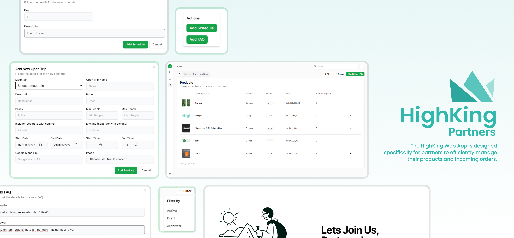

<h1> HighKing Partners Web Application </h1>

<a href="#-introduction">Introduction</a> &nbsp;&bull;&nbsp;
<a href="#-tech-stack">Tech Stack</a> &nbsp;&bull;&nbsp;
<a href="#-reference">Reference</a> &nbsp;&bull;&nbsp;
<a href="#-issues">Issues</a> &nbsp;&bull;&nbsp;
<a href="#-deployment">Deployment</a>

## 📄 Introduction

The HighKing Partners Web App is tailored for open trip partners to efficiently manage their products and incoming orders. Developed using Next.js, this capstone project provides a comprehensive platform for partners to track reservations, update trip details, and communicate with clients.

## 💫 Full Documentation

[Notion Documentation of the Web Application](https://regal-flannel-91c.notion.site/HighKing-Web-Application-35275c2ffffa41a8af11d8a4bd6fa65b?pvs=4)

## 💻 Tech Stack

## 📚 Reference

- [Next.js Documentation](https://nextjs.org/docs)
- [React Documentation](https://reactjs.org/docs/getting-started.html)
- [Node.js Documentation](https://nodejs.org/en/docs/)
- [Postman Documentation](https://learning.postman.com/docs/getting-started/introduction/)
- [Shadcn UI Documentation](https://ui.shadcn.com/docs)
- [Aceternity UI Documentation](https://ui.aceternity.com/docs/install-nextjs)

## 🚩 Issues

If you find a bug or an issue, please report it by opening a new issue on [this repository](https://github.com/ENTS-H104/highking-partners-web/issues).

## 🚀 Deployment
The deployment of the HighKing Partners Web App is hosted on [Vercel](https://vercel.com/). You can access the live version of the app [here](https://highking-partners-web.vercel.app/).
